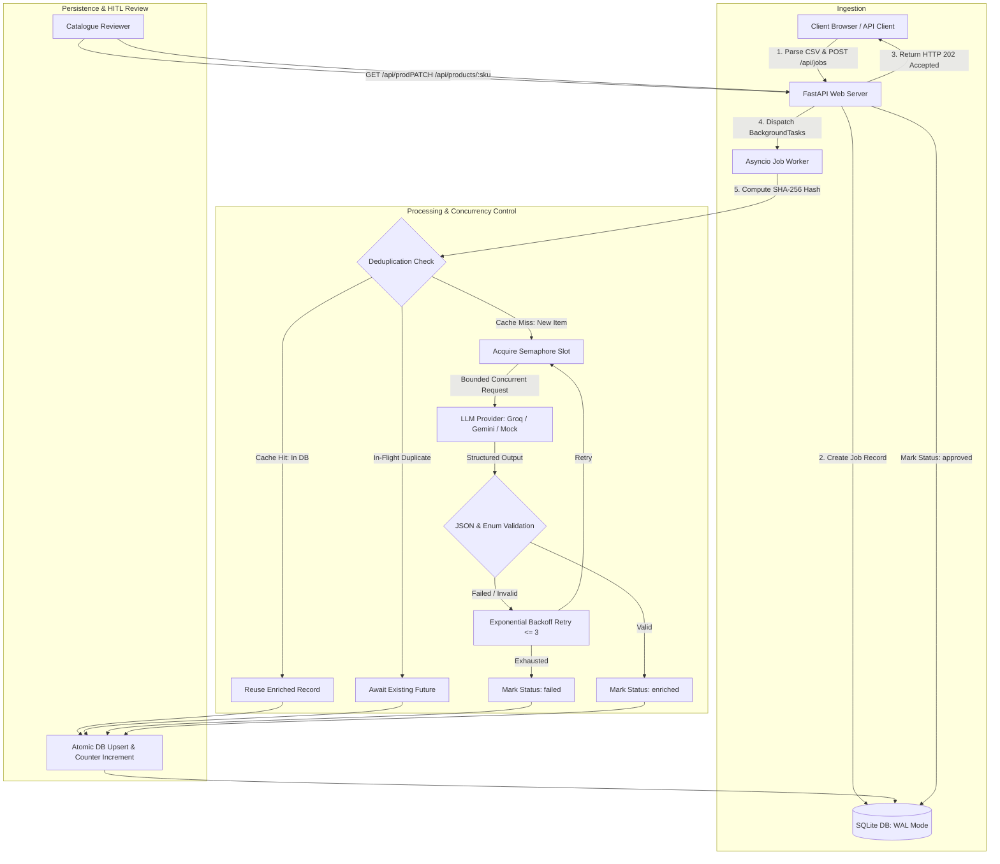

# CatalogIQ — System Design Document

## 1. System Overview & Architecture

CatalogIQ is an asynchronous e-commerce catalogue enrichment engine. It ingests messy, unstructured product listings, cleans titles, assigns standardized taxonomy categories, extracts brands, and generates normalized tags using Large Language Models (LLMs) with strict concurrency control, content-hash deduplication, and human-in-the-loop review.



---

## 2. Alternatives Considered & Rejected

| Decision Area | Selected Approach | Alternative Rejected | Rationale |
| :--- | :--- | :--- | :--- |
| **Concurrency Model** | **`asyncio` Event Loop** | OS Threads (`threading`) & Multi-processing (`multiprocessing`) | LLM enrichment is network I/O-bound. Coroutines consume ~2 KB RAM each (allowing 10,000+ concurrent tasks in ~20 MB RAM), whereas OS threads consume ~8 MB stack each and incur kernel context-switching overhead. Multi-processing was rejected due to heavy process memory duplication and IPC serialization costs. |
| **Storage Engine** | **SQLite with WAL Mode** | PostgreSQL / MySQL | For a self-contained service, SQLite in Write-Ahead Logging (WAL) mode supports concurrent readers without blocking writes, provides full ACID compliance, zero operational setup, and sub-millisecond local queries without network hops. |
| **Task Queue (MVP)** | **FastAPI BackgroundTasks + Shared Semaphore** | Celery + RabbitMQ / Redis | An in-process task runner with an `asyncio.Semaphore` satisfies single-instance requirements with zero external dependencies. Celery introduces worker heartbeat overhead, broker operations, and state synchronization friction for single-node deployments. |
| **Client Ingestion** | **Client-Side CSV Parsing (PapaParse)** | Server-side Multipart File Streaming | Parsing CSV in the browser directly transmits structured JSON payloads to `/api/jobs`, allowing immediate client-side column validation, reducing server CPU overhead, and eliminating temporary file management on the server. |

---

## 3. Core Architectural Questions

### 1. Architecture: Flow, Parallelism & Concurrency

- **End-to-End Flow:**
  1. **Upload & Ingestion:** The client parses the CSV and issues a `POST /api/jobs` request containing an array of products.
  2. **Job Registration:** The server generates a unique `job_id`, inserts a `jobs` row with `status='running'`, and returns `HTTP 202 Accepted` with the job schema within milliseconds.
  3. **Background Dispatch:** FastAPI's `BackgroundTasks` schedules `process_job(job_id, products)` onto the running `asyncio` event loop.
  4. **Parallel Processing:** Products are mapped into concurrent tasks via `asyncio.gather(*[_process_single_product(...)])`.
  5. **Deduplication:** Each product computes a normalized SHA-256 hash (`raw_title + " " + raw_description`). If a completed product with this hash exists, it reuses the data (cache hit). If an identical product is currently being processed, subsequent requests await the active task's `asyncio.Future` (in-flight deduplication).
  6. **Concurrency Limiter:** Unique items acquire a slot from a global `asyncio.Semaphore(LLM_CONCURRENCY)` (default: 5). Only 5 simultaneous LLM HTTP requests are made at any given time, regardless of whether 100 or 10,000 items are queued.
  7. **Validation & Retries:** Successful LLM outputs undergo Pydantic validation and taxonomy checking. Failed calls retry up to 3 times with exponential backoff and jitter (`1.0s`, `2.0s`, `4.0s`).
  8. **Persistence:** Products are atomically upserted (`upsert_product`), counters (`done`, `failed`, `cache_hits`) are incremented, and the job status transitions to `'completed'`.

- **Why `asyncio` was chosen:**
  LLM enrichment spends 98% of its lifecycle awaiting remote HTTP responses. `asyncio` enables cooperative multitasking without thread starvation or GIL contention, switching tasks in microseconds with negligible memory overhead.

---

### 2. Crash Recovery (Server Restarts Halfway Through a 10,000-Item Job)

- **What Happens Currently:**
  If the process crashes at item 5,000, items 1–5,000 are already committed in the SQLite database (`status='enriched'`), because each product is committed immediately upon completion. The in-memory tasks for items 5,001–10,000 are lost, and the job record remains in `status='running'`.

- **Production Recovery Strategy:**
  1. **Durable Item Queue:** At ingestion, insert all 10,000 products into the database with `status='pending'` associated with the `job_id`.
  2. **Startup Reconciliation Worker:** In FastAPI's lifespan startup handler:
     ```python
     # Query incomplete jobs
     SELECT id FROM jobs WHERE status = 'running';
     # For each job, find unfulfilled items
     SELECT * FROM products WHERE job_id = ? AND status IN ('pending', 'running');
     ```
     Automatically reschedule uncompleted items into the task processor.
  3. **Idempotency via Content Hash & UPSERT:**
     Because `sku` is the primary key (`ON CONFLICT(sku) DO UPDATE`) and `content_hash` caches finished results, re-running a job never duplicates finished work and never invokes the LLM for items already enriched.
  4. **Distributed Lease / Heartbeat (Distributed Scale):**
     In a distributed queue (e.g., Redis Streams / Celery), items are leased with a visibility timeout (e.g., 60s). If a worker dies, the unacknowledged item automatically reappears on the queue for another worker to claim.

---

### 3. Scale and Cost (1 Million Listings/Day with Strict RPM Limits)

Handling 1,000,000 listings/day requires processing ~12 items/sec continuously (or 50–100 items/sec peak). If an LLM provider enforces a strict limit (e.g., 300 RPM), the system employs five layers of defense:

1. **Prompt Batching (5–10 Products per Request):**
   Instead of 1 item per API call, serialize 5–10 items into a single structured prompt:
   `"Enrich the following 10 products: [{id: 1, title: ...}, ...]"`.
   This reduces 1,000,000 daily requests down to 100,000–200,000 calls (a **5x–10x reduction in HTTP requests** and significant token savings on repeated system prompts).
2. **Deterministic Content Caching:**
   Retail datasets frequently contain duplicate listings across sellers and slight variant titles. Normalizing and hashing content yields a 30%–50% cache hit rate in practice, eliminating 300,000–500,000 LLM calls entirely.
3. **Distributed Token-Bucket Rate Limiter:**
   Deploy a Redis-backed sliding-window rate limiter using Lua scripts (`ratelimit:llm_rpm`). Workers across multiple instances atomically consume tokens before making requests, guaranteeing the global 300 RPM ceiling is never breached.
4. **Decoupled Worker Fleet:**
   Split API servers from background workers using a durable queue (RabbitMQ / Redis Streams / Amazon SQS). Web instances accept customer jobs without delay, while autoscaling worker instances drain the queue at a pace strictly governed by the rate limiter.
5. **Tiered Provider Fallback:**
   - **Tier 1 (Primary):** Low-cost, high-speed provider (e.g., Groq Llama 3 70B @ $0.59/M tokens).
   - **Tier 2 (Fallback on 429/503):** Automatically failover to a secondary provider (e.g., Google Gemini 1.5 Flash).
   - **Tier 3 (Complexity Routing):** Use a lightweight model (e.g., Llama 3 8B) for obvious titles, escalating only low-confidence or long-tail items to larger models.

---

### 4. API Performance (5 Million Products & `GET /api/products?q=...`)

At 5,000,000 records, naive queries like `WHERE clean_title LIKE '%phone%'` trigger full table scans, resulting in multi-second latency and I/O bottlenecks. The optimizations required are:

1. **Full-Text Search (FTS5 / GIN Indexes):**
   - *Current SQLite:* Use an `FTS5` virtual table with trigram or Porter stemming indexing `clean_title`, `raw_title`, and `brand`. FTS lookups run in under 5ms using inverted indexes instead of table scans.
   - *PostgreSQL / Distributed:* Use PostgreSQL `tsvector` with `GIN` index, or offload search to Elasticsearch/OpenSearch.
2. **Keyset / Cursor Pagination (Eliminating `OFFSET`):**
   - High-offset queries (`LIMIT 20 OFFSET 200000`) force the engine to scan and discard 200,000 rows.
   - Replace with cursor-based pagination using the indexed primary key:
     ```sql
     SELECT * FROM products
     WHERE sku > :last_seen_sku AND category = :cat
     ORDER BY sku ASC
     LIMIT 20;
     ```
     Cursor seeks execute in $O(\log N)$ index operations regardless of page depth.
3. **Covering Indexes for Filters:**
   Create composite indexes matching common query patterns:
   `CREATE INDEX idx_products_cat_status ON products(category, status, sku);`
4. **Query & Count Caching:**
   `COUNT(*)` on 5M rows is expensive. Cache count totals in Redis with a 60-second TTL, or return an estimated/windowed count (`has_next_page`) to avoid computing the exact total on every search keystroke.

---

### 5. Quality Assurance & Human-in-the-Loop (HITL)

LLMs occasionally hallucinate nonexistent brands (e.g., deriving "SuperPower" from generic descriptions) or assign incorrect taxonomy categories. CatalogIQ safeguards catalogue integrity via automated guardrails and prioritized human review:

1. **Deterministic Grounding & Hallucination Detection:**
   - **Brand Extraction Verification:** The extracted `brand` must either exist as an exact/fuzzy substring within the input `raw_title` / `raw_description`, or match against a canonical Brand Dictionary (e.g., 50,000 verified retail brands). If an extracted brand is absent from both, it is flagged as a potential hallucination.
   - **Taxonomy Whitelisting:** Categories must match predefined Enum values (`Groceries`, `Beverages`, etc.). Any unauthorized category is rejected during schema validation.
2. **Confidence Scoring & Anomaly Detection:**
   Every enriched product receives an automated confidence score (0.0 to 1.0) based on:
   - High text overlap between `clean_title` and `raw_title`.
   - Brand presence in source text (+0.3).
   - Valid category keyword correlation (+0.3).
   - Zero LLM retry attempts (+0.2).
   - Valid non-empty tags array (+0.2).
3. **Triaged Review Queues:**
   - **High Confidence ($\ge 0.85$):** Auto-published with `status='enriched'`.
   - **Low Confidence ($< 0.85$) or Repeated Retries:** Assigned `status='needs_review'`.
4. **Operator Workflow:**
   Reviewers access the web UI filtered by `status='needs_review'`. The UI highlights original raw inputs alongside enriched predictions. Operators can modify titles, categories, or tags with one click and commit the changes via `PATCH /api/products/:sku`, marking the item as `approved`.
5. **Continuous Improvement Loop:**
   Human corrections from `PATCH /api/products/:sku` are logged as gold-standard pairs, dynamically updating few-shot prompt examples and expanding the brand alias dictionary.
