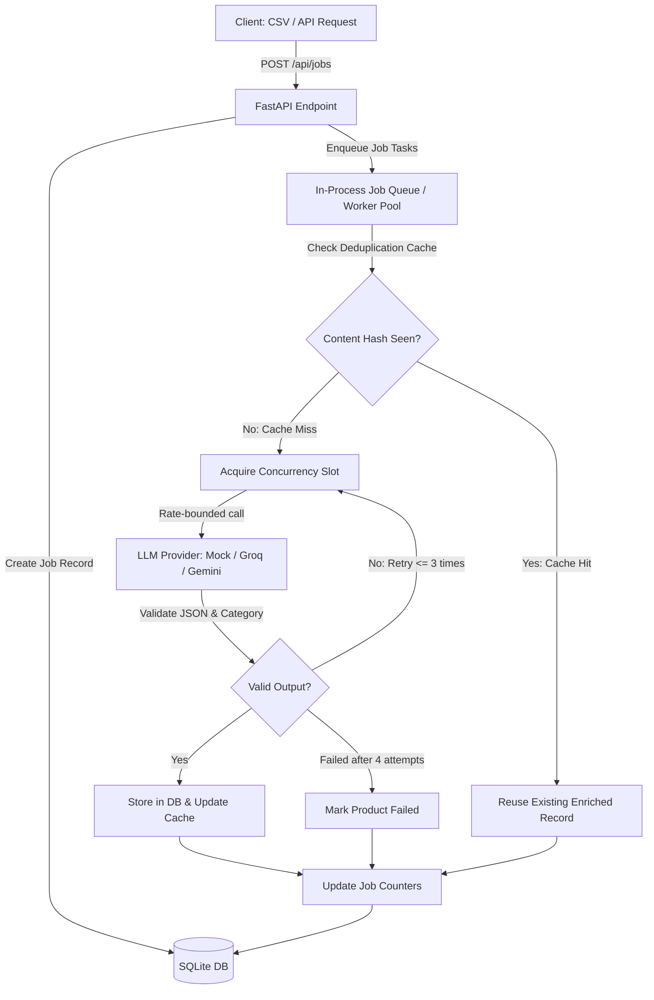

# CatalogIQ — System Design Document

## 1. System Overview & Architecture

CatalogIQ is designed to take unstructured and noisy product listings and transform them into clean, standardized catalogue entries via an asynchronous enrichment pipeline with controlled LLM concurrency and caching.

---

## 2. Key Architectural Decisions & Alternatives Rejected

### Chosen Stack:
- **FastAPI + Asyncio**: Native asynchronous I/O allows thousands of concurrent network-bound requests without thread overhead.
- **SQLite**: Zero-maintenance, single-file relational database that guarantees persistence across restarts without external service dependencies.
- **In-Memory Concurrency Semaphore (`asyncio.Semaphore`)**: Enforces global concurrency across all jobs cleanly without requiring external brokers like Redis.

### Alternatives Rejected:
- **Celery + Redis**: Overkill for a 2-day assignment, introduces operational overhead and failure points without necessity.
- **PostgreSQL**: Adds unnecessary setup friction; SQLite satisfies ACID requirements and portability.
- **Frontend Frameworks (React, Vue)**: Requirement mandates plain HTML/CSS/JS without build tools.

---

## 3. Core Design Questions (Assignment Part 4)

### 3.1 Architecture: Job Execution & Concurrency
- *Pipeline Flow*: Jobs are accepted with HTTP 202 Accepted. Processing runs in an `asyncio` task pool.
- *Concurrency Enforcement*: An `asyncio.Semaphore(LLM_CONCURRENCY)` limits simultaneous LLM requests globally across all ongoing jobs.

### 3.2 Crash Recovery
- Job progress and product statuses (`queued`, `running`, `enriched`, `failed`) are persisted in SQLite.
- On startup, unfinished jobs can be scanned and resumed from the last uncompleted item without duplicate LLM calls.

### 3.3 Scale & Cost Optimization
- Normalization and deterministic hashing (`raw_title + " " + raw_description`) prevent duplicate LLM calls.
- In-flight deduplication prevents redundant parallel calls for identical items submitted concurrently.

### 3.4 API Performance at Scale
- SQLite indexing on SKU, category, and full-text search (SQLite FTS5) for fast search queries.
- Pagination implemented via standard limits/offsets or keyset cursors.

### 3.5 Quality Assurance & Human-in-the-Loop
- Strict JSON schema validation and category enum enforcement.
- Product review workflows (`PATCH /api/products/<sku>`) enable operators to correct titles, categories, or tags.

*(Full detailed analysis will be updated alongside pipeline implementation).*
